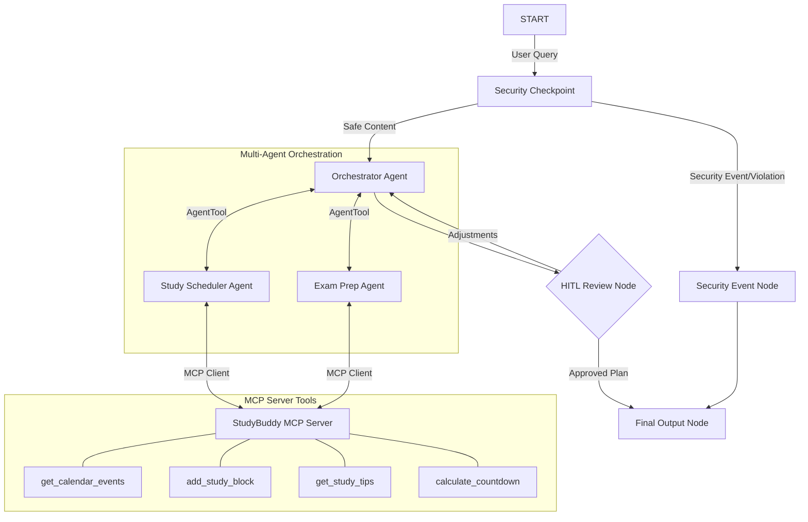

# Submission Write-Up: StudyBuddy Planner 🎓

## Problem Statement
Students face significant stress managing course schedules, studying for midterms/finals, and keeping track of deliverables. Traditional calendars do not help students dynamically structure their daily study routines or calculate targeted exam milestones. Furthermore, exposing academic systems to open LLM agents introduces risks of prompt injections and private student data leaks (PII).

StudyBuddy Planner addresses this need by providing a secure, automated academic planner that schedules balanced study blocks, generates structured exam milestones, and operates under strict security and privacy guardrails.

## Solution Architecture
Below is the workflow graph showing how queries are parsed, processed, reviewed by the student, and finalized:

## Concepts Used

1. **ADK 2.0 Workflows**: Graph-based topology connecting nodes and edges. Implemented in [app/agent.py](file:///e:/Arnab%20Docs/Google%20Kaggle%20Course%20-%20June/ADK-ProjectWork/studybuddy-planner/app/agent.py#L182-L195).
2. **LlmAgent**: Specialized agents utilizing Gemini for distinct tasks. Defined in [app/agent.py](file:///e:/Arnab%20Docs/Google%20Kaggle%20Course%20-%20June/ADK-ProjectWork/studybuddy-planner/app/agent.py#L35-L60).
3. **AgentTool**: Orchestrator-to-sub-agent delegation mechanism. Defined in [app/agent.py](file:///e:/Arnab%20Docs/Google%20Kaggle%20Course%20-%20June/ADK-ProjectWork/studybuddy-planner/app/agent.py#L76-L91).
4. **MCP Server**: Custom stdio Model Context Protocol (MCP) server providing external tool bindings. Implemented in [app/mcp_server.py](file:///e:/Arnab%20Docs/Google%20Kaggle%20Course%20-%20June/ADK-ProjectWork/studybuddy-planner/app/mcp_server.py).
5. **Security Checkpoint**: Graph node that performs validation before running agent steps. Implemented in [app/agent.py](file:///e:/Arnab%20Docs/Google%20Kaggle%20Course%20-%20June/ADK-ProjectWork/studybuddy-planner/app/agent.py#L93-L151).
6. **Agents CLI**: Scaffolded and built utilizing `agents-cli scaffold create` and configured with [agents-cli-manifest.yaml](file:///e:/Arnab%20Docs/Google%20Kaggle%20Course%20-%20June/ADK-ProjectWork/studybuddy-planner/agents-cli-manifest.yaml).

## Security Design

- **PII Scrubbing**: Prevents students' private contact details and student registration numbers from leaking to external LLM APIs. Scrubbing is implemented using regex for emails, phone numbers, and student IDs (`S\d{5,8}`).
- **Prompt Injection Detection**: Blocks malicious commands from hijacking the orchestrator or sub-agents (keywords check: `ignore instructions`, `system prompt`, etc.).
- **Domain Specific Guardrail**: Promotes student wellness by enforcing a maximum of 16 study hours per day, preventing the system from planning unhealthy routines.
- **Audit Logging**: Emits JSON logs to standard output/logs at distinct severity levels (`INFO`, `WARNING`, `CRITICAL`) to document safety decisions.

## MCP Server Design

Our custom MCP server exposes 4 tools via stdio transport:
1. `get_calendar_events`: Retrieves existing assignments and exams, letting the planner avoid scheduling conflicts.
2. `add_study_block`: Writes scheduled study events back to a mock calendar.
3. `get_study_tips`: Recommends academic learning strategies based on the target subject (e.g. active coding for CS, practice problems for Math).
4. `calculate_countdown`: Calculates days/weeks left until exam date to assist milestones generation.

## Human-in-the-Loop (HITL) Flow

A `hitl_review_node` is positioned immediately after the plan generation step. Academic planning requires students' ultimate consent. Students can review the weekly study blocks and exam milestones draft, and either type `approve` (which schedules the study blocks to their calendar and finishes the workflow) or type feedback (e.g. `"add more breaks on the weekends"`), which routes back to the orchestrator to adjust the plan.

## Demo Walkthrough

- **Test Case 1 (Standard Flow)**: Inputting a request for a CS 101 Midterm schedules study blocks using MCP, calculates exam countdown, and presents the draft in the UI. Approving the draft saves the calendar blocks.
- **Test Case 2 (PII Redaction)**: Inputting a student ID and email alongside a Math study tip request redacts the PII first, then retrieves custom Math study tips from the MCP server.
- **Test Case 3 (Security Violation)**: Requesting a 24-hour study day immediately flags a safety warning, terminating the scheduling flow with an advisory notice.

## Impact / Value Statement
StudyBuddy Planner automates the tedious task of dividing academic loads into weekly sub-tasks, helping students achieve better time management. By using strict security policies, universities can deploy this concierge agent safely, knowing that student identity and data privacy are fully protected.
